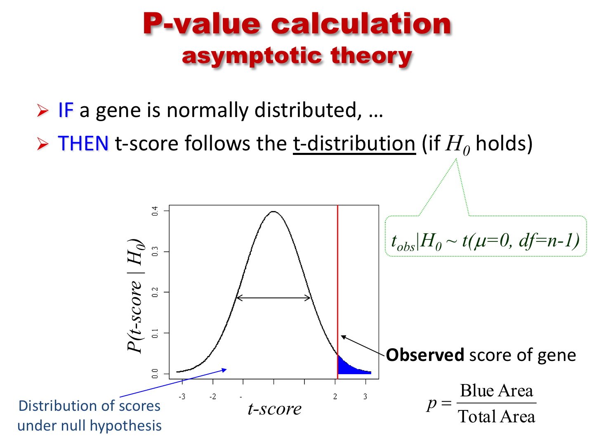
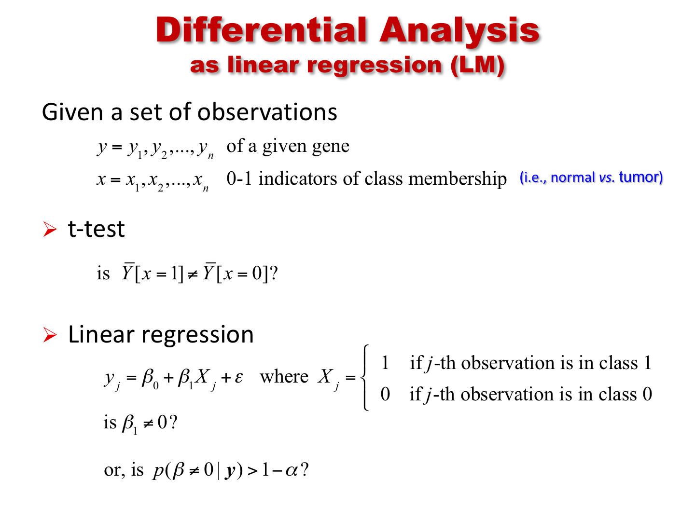

```{r global, echo=FALSE,message=FALSE, warning=FALSE, eval=FALSE}
knitr::opts_chunk$set(message=FALSE, warning=FALSE)
devtools::load_all(".")
require(Biobase) 
require(limma)
require(VennDiagram)
require(ComplexHeatmap)
require(circlize)
require(ggplot2)
require(vennr) # see github.com/montilab/vennr
```

```{r settings,message=FALSE, warning=FALSE, eval=TRUE}
knitr::opts_chunk$set(message=FALSE, warning=FALSE)
require(BS831)
require(Biobase) 
require(limma)
require(VennDiagram)
require(ComplexHeatmap)
require(circlize)
require(ggplot2)
require(vennr) # see github.com/montilab/vennr
```

In this module, we explore the use of different R functions to perform differential analysis.
In particular, we show few examples of gene expression (GE) differential analysis based on the use of the functions `t.test` and `lm`, as well as the package `limma`, which implements a "moderated" t-test with pooled variance (see <a
href="http://bioconductor.case.edu/bioconductor/2.10/bioc/vignettes/limma/inst/doc/usersguide.pdf">documentation</a>).

We also recall how to perform differential analysis by fitting a
linear model, and the relationship of this approach to the use of the t-test.




## Differential expression analysis using `t.test`

We start by uploading a subset of the TCGA Breast Cancer dataset (in `ExpressionSet` format), and by showing the use of the function `t.test`. Below, we just carry out some "data cleaning" to simplify data handling, and limit the datasets to two molecular subclasses, Luminal A and Basal. These are two of the five classes of the "Pam50" molecular classification of Breast Cancer [[Sorlie et al., PNAS 2001](https://www.pnas.org/content/98/19/10869)].

```{r load.data, echo=FALSE}
eset <- readRDS(file.path(Sys.getenv("OMPATH"),"data/TCGA.BRCA25.rds"))
```

```{r load.data.dummy, eval=FALSE}
## load the ExpressionSet object
data(TCGA.BRCA25)
eset <- TCGA.BRCA25
```

```{r dataprep}
## show the dataset composition (in terms of phenotypic classes)
print(table(eset$pam50))

## Let us limit the analysis to two sub-classes: Luminal A and Basal
cancerSet <- eset[,eset$pam50 %in% c("LumA","Basal")]
cancerSet$pam50 <- droplevels(cancerSet$pam50)

## let's order samples by the phenotype
cancerSet <- cancerSet[,order(cancerSet$pam50)]
print( table(cancerSet$pam50) )
```

We have extracted the data of interest into the object
`cancerSet`. We are now ready to use the
`t.test` function. We first show its use applied to a
single gene.

```{r ttest}

## split the data into the two diseaseState groups
group1 <- exprs(cancerSet)[, cancerSet$pam50=="LumA"]
group2 <- exprs(cancerSet)[, cancerSet$pam50=="Basal"]
dim(group1)                   # show the size of group1
dim(group2)                   # show the size of group2
table(cancerSet$pam50) # show the size concordance with the phenotype annotation

## for ease of use let's define the variable pheno (although this can be error prone)
pheno <- as.factor(cancerSet$pam50)

## use gene symbols to index the rows (rather than the entrez IDs)
rownames(group1) <- fData(cancerSet)$hgnc_symbol
rownames(group2) <- fData(cancerSet)$hgnc_symbol

## show few entries of group1 (the fist 5 genes in the first 5 samples)
group1[1:5,1:3]

## let us show the use of t.test on a single gene (the 1st)
T1 <- t.test(x=group1[1,],y=group2[1,],alternative="two.sided")
T1

## the default is to perform t-test w/ unequal variance. Let's try w/ equal variance
T2 <- t.test(x=group1[1,],y=group2[1,],alternative="two.sided",var.equal=TRUE)
T2
```

We then show how to apply it to all the genes in the dataset.

```{r multi.ttest1}
## apply the t.test to each gene and save the output in a data.frame
## note: this is equivalent to (i.e., no more efficient than) a for loop

ttestRes <- data.frame(t(sapply(1:nrow(group1),
     function(i){
          res <- t.test(x = group1[i, ], y = group2[i,], alternative ="two.sided")
          res.list <-  c(t.score=res$statistic,t.pvalue = res$p.value)
          return(res.list)
      })))
## use the gene names to index the rows (for interpretability)
rownames(ttestRes) <- rownames(group1)
```

In the application above, we made use of the
`t.test(x,y,...)` version of the command. However, the use
of the `t.test(formula,...)` version of the command turns
out to be simpler and more elegant, as it does not require to split
the dataset into two groups.

```{r multi.ttest2}
## application to a single gene but using the formula
T3 <- t.test(exprs(cancerSet)[1,] ~ pheno)
print(T3) # same results as before
T3$statistic==T1$statistic

## application to all genes (coerce output into data.frame for easier handling)
ttestRes1 <- as.data.frame(
  t(apply(exprs(cancerSet),1,
          function(y) {
            out <- t.test(y~pheno,var.equal=TRUE)
            c(t.score=out$statistic,t.pvalue=out$p.value)
            })))
## use the gene names to index the rows (for interpretability)
rownames(ttestRes1) <- fData(cancerSet)$hgnc_symbol

## let us add to the output data.frame an extra column reporting the FDR
## .. (i.e., the MHT-corrected p-value)
ttestRes1$t.fdr <- p.adjust(ttestRes1$t.pvalue, method = "BH")

## show few entries
head(ttestRes1)
```

### Heatmap visualization
We now show how to visualize the top markers for each class by means of the `Heatmap` function defined in the `ComplexHeatmap` package.

```{r heatmap}
## let us sort the output by t-score
ttestOrd <- order(ttestRes1[,'t.score.t'],decreasing=TRUE)

## let us visualize the top 50 and bottom 50 genes
hiIdx <- ttestOrd[1:50]
loIdx <- ttestOrd[nrow(ttestRes1):(nrow(ttestRes1)-49)]
datOut <- exprs(cancerSet)[c(hiIdx,loIdx),]
datScaled <- t(scale(t(datOut))) # row scale the matrix for better visualization

ha.t <- HeatmapAnnotation(pam50=cancerSet$pam50,
                          col=list(pam50=c(LumA="green",Basal="red")))

Heatmap(datScaled,
        name="expression", 
        col=colorRamp2(c(-3, 0, 3), c("darkblue", "white", "darkred")),
        top_annotation=ha.t, 
        cluster_rows=FALSE,
        cluster_columns=FALSE,
        row_title="",
        show_column_names=FALSE,
        show_row_names=FALSE)
```

## Differential expression analysis using `lm`

We now show the use of the function `lm` (for linear model)
to perform the same analysis. As discussed in class, we can regress
the expression of a gene on the phenotype variable (in this case, a
binary variable). Below, we apply it to a single gene first, and show
that the test result is the same as for the `t.test` with equal
variance. We then apply it to all the genes in the dataset.

```{r lmdiffanal}
## application to a single gene
LM1 <- lm(exprs(cancerSet)[1,] ~ pheno)
summary(LM1)

## same p-value as for T2 above
all.equal(T2$p.value,summary(LM1)$coefficients[2,"Pr(>|t|)"])

## application to all genes
ttestRes2 <- as.data.frame(t(apply(exprs(cancerSet),1,
                                   function(y) {
                                       out <- summary(lm(y~pheno))$coefficients
                                       c(t.score=out[2,"t value"],t.pvalue=out[2,"Pr(>|t|)"])
                                   })))
## use the gene names to index the rows (for interpretability)
rownames(ttestRes2) <- fData(cancerSet)$hgnc_symbol

## let us add to the output data.frame an extra column reportding the FDR
## .. (i.e., the MHT-corrected p-value)
ttestRes2$t.fdr <- p.adjust(ttestRes2$t.pvalue, method = "BH")

## the scores are the same (modulo the sign, which is arbitrary)
plot(ttestRes1$t.score.t,ttestRes2$t.score,pch=20,xlab="t.test scores",ylab="lm scores")
all.equal(-ttestRes1$t.score.t,ttestRes2$t.score)
```

## Differential expression analysis using the `limma` package

With this package, we are performing differential analysis taking the
"linear regression" approach (i.e., by regressing each gene's
expression on the phenotype variable (and possibly, on other
covariates). The main difference is in the estimation of the variance,
which is here 'pooled' across multiple genes with similar expression
profiles. This pooling is particularly useful with small sample size
datasets, where the variance estimates of individual genes can be
extremely noisy, and pooling multiple genes allows for "borrowing" of
information.

Fitting a `limma` model includes the following steps:

1. Definition of the "design matrix"

2. Definition of the "contrast." 

3. Fitting of the linear model.

4. Fitting the contrast.

5. Bayesian "moderation" of the genes' standard errors towards a common value.

6. Extract the relevant differential analysis information (fold-change, p-value, etc.)

Depending on the design matrix definition, steps 2 and 4 might or might not be needed. In particular, if the result of interest is  captured by a single model parameter, than the definition and fitting of the contrast can be skipped.

To be more specific, a standard linear model for the differential analysis with respect to a gene can be specified in one of two ways. 

(@standard_eq)
$$Y_{gene} = \beta_0 + \beta_1 X_{pheno}$$

where $X$ takes the values $0$ and $1$, depending on whether the sample belongs to class 0 or 1. Or,

(@contrast_eq)
$$Y_{gene} = \beta_0X_{0}+ \beta_1X_1$$

where $X_0X_1 = 01$ for samples in class 0, and $X_0X_1=10$ for samples in class 1. 

It should be clear that in Equation (@standard_eq), the parameter $\beta_1$ captures the relevant difference, while in Equation (@contrast_eq), the difference $\beta_0-\beta_1$ captures the differential value of interest. Thus, in the first formualation, we will not need to define a contrast, while in the second formulation we do. 

In the following code chunk, we use the model of Equation (@contrast_eq), hence we need to define and fit the contrast.
```{r limma}
## 1. Definition of the "design matrix"
design <- model.matrix(~0 + factor(pheno)) 
colnames(design)
colnames(design) <- c("LumA", "Basal")
print(unique(design)) # show the 'coding' for the two classes
## 2. Definition of the "contrast"
contrast.matrix <- makeContrasts(LumA-Basal, levels = design)
## 3. Fitting the model
fit <- lmFit(cancerSet, design)
## 4. Fitting the contrast
fit <- contrasts.fit(fit,contrast.matrix)
## 5. Bayesian "moderation"
fit <- eBayes(fit)
head(fit$coefficients)

## 6. extract the relevant differential analysis information, sorted by p-value
limmaRes <- topTable(fit, adjust.method = "BH", n = Inf, sort.by = "P")
```

## Comparing t-test and limma results

```{r compareDE}
## comparing t-test results to limma results
combinedRes <- data.frame(limmaRes, ttestRes1[match(limmaRes$hgnc_symbol, rownames(ttestRes1)),],
                          check.names=FALSE)
ggplot(combinedRes, aes(x=t,y=t.score.t)) +
    geom_point() +
    labs(x="limma t-statistic",y="t.test t-statistic")

ggplot(combinedRes, aes(x=P.Value,y=t.pvalue)) +
    geom_point() +
    labs(x="limma p-value",y="t.test p-value")

ggplot(combinedRes, aes(x=adj.P.Val,y=t.fdr)) +
    geom_point() +
    labs(x="limma FDR",y="t.test FDR")
```

As noted above, `limma` performs shrinkage of the variance estimates, by borrowing information across similar genes. Here, we show the effect of that shrinkage.
```{r compareSD}
## limma performs eBayes shrinkage of variance estimates, resulting in moderated t-statistics
empS <- apply(exprs(cancerSet), 1, var)
par(mar=c(5,5,2,2))
n <- length(empS)
plot(1,1,xlim=c(0,14),ylim=c(0,1),type="n",
     xlab="variance estimates",ylab="",yaxt="n")
axis(2,at=c(0.9,0.1),c("shrunken \n variance","sample \n variance"),las=2)
segments(fit$s2.post, rep(.9, n),empS,rep(.1,n))
```

Finally, we compare the two analyses based on the number of genes found to be significant by the two methods, and we look at the overlap.
```{r count.and.overlap}
print(data.frame("p=0.05"=c(limma=sum(combinedRes$adj.P.Val<=0.05),ttest=sum(combinedRes$t.fdr<=0.05)),
                 "p=0.01"=c(limma=sum(combinedRes$adj.P.Val<=0.01),ttest=sum(combinedRes$t.fdr<=0.01)),
                 check.names=FALSE))

## what is the overlap between t-ttest and limma derived significant genes? (top1k)
qThresh <- 0.01
top.ttest <- rownames(combinedRes)[combinedRes$t.fdr<=qThresh]
top.limma <- rownames(combinedRes)[combinedRes$adj.P.Val<=qThresh]
topGenes <- list(top.ttest = top.ttest, top.limma = top.limma)

vennr(topGenes)
```

## Modelling with covariates

```{r newESET}
data(breast_loi_133p2)

## load the ExpressionSet object
BC <- breast_loi_133p2
pData(BC)[1:5,1:6] # show some data annotation

## select top 5000 genes by MAD
MAD <- apply(exprs(BC),1,mad)
BC5K <- BC[order(MAD,decreasing=TRUE)[1:5000],]
dim(BC5K)

## to reuse the same code below, just assign the new dataset to BC
BC <- BC5K
  
# Reformat LN variable and subset
BC$LN_status <- c("negative","positive")[BC$LN_status+1]
pData(BC) <- pData(BC)[, c("LN_status", "age")]
```

### Model without age covariate
```{r limmaNEW}
#Next, we'll add age as a covariate

design <- model.matrix(~ 0 + factor(LN_status), data = pData(BC))
colnames(design)
colnames(design) <- c("negative", "positive")
head(design)

contrast.matrix <- makeContrasts(positive-negative, levels = design)
fit <- lmFit(BC, design)
fit <- contrasts.fit(fit,contrast.matrix)
fit <- eBayes(fit)
head(fit$coefficients)

## get full differential expression output table, sorted by p-value
limmaRes <- topTable(fit, adjust.method="BH", n=Inf, sort.by="P")
head(limmaRes)
```

### Model with age covariate
```{r limmaCOV}
#Next, we'll add age as a covariate

designBC <- model.matrix(~ 0 + factor(LN_status) + age, data = pData(BC))
colnames(designBC)
colnames(designBC) <- c("negative", "positive", "age")
head(designBC)

contrast.matrixBC <- makeContrasts(positive-negative, levels = designBC)
fitBC <- lmFit(BC, designBC)

# Difference in expression between LN_status = positive and LN_status = negative individuals
fitC <- contrasts.fit(fitBC,contrast.matrixBC)
fitC <- eBayes(fitC)
head(fitC$coefficients)
#get full differential expression output table, sorted by p-value
limmaResC <- topTable(fitC, adjust.method = "BH", n = Inf, sort.by = "P")
head(limmaResC)

# Effect of age
fitA <- eBayes(fitBC)
head(fitA$coefficients)
#get full differential expression output table, sorted by p-value
limmaResA <- topTable(fitA, adjust.method = "BH", n = Inf, sort.by = "P", coef = "age")
head(limmaResA)
```

### Model with age:LN_status interaction
```{r limmaInter}
#Next, we'll model the interaction between age and LN_status
designI <- model.matrix(~ 0 + factor(LN_status) + age + factor(LN_status):age, data = pData(BC))
colnames(designI)
colnames(designI) <- c("negative", "positive", "age", "positiveIage")
head(designI)

contrast.matrixI<- makeContrasts(positive-negative, levels = designI)
fitI <- lmFit(BC, designI)

# Difference in expression between LN_status = positive and LN_status = negative individuals
fitIC <- contrasts.fit(fitI,contrast.matrixI)
fitIC <- eBayes(fitIC)
head(fitIC$coefficients)
#get full differential expression output table, sorted by p-value
limmaResIC <- topTable(fitIC, adjust.method = "BH", n = Inf, sort.by = "P")
head(limmaResIC)

# Effect of age on LN_status = negative individuals
fitIA <- eBayes(fitI)
head(fitI$coefficients)
#get full differential expression output table, sorted by p-value
limmaResIA <- topTable(fitIA, adjust.method = "BH", n = Inf, sort.by = "P", coef = "age")
head(limmaResIA)

# Difference in effect of Age between LN_status = positive and LN_status = negative participants
limmaResIP <- topTable(fitIA, adjust.method = "BH", n = Inf, sort.by = "P", coef = "positiveIage")
head(limmaResIP)
```
