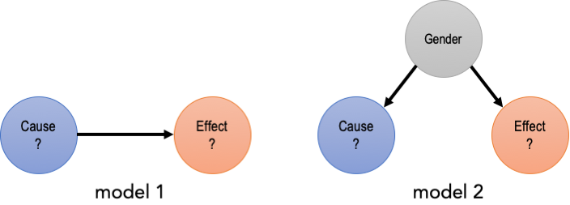

```{r setup, include=FALSE}
knitr::opts_chunk$set(echo = TRUE, message=FALSE, warning=FALSE)
```

```{r settings}
library(ggplot2)
library(dplyr)
```

Here, we show a simple example of how a 'confounder' (gender, in the example), can lead to a spurious association between two variables.

## Data Generation

<p align=center>

</p>

We generate simulated data from two models. In model 1, _cause_ follows a standard normal distribution (mean=0, stdev=1), and _effect_ also follows a normal distribution, but with its mean a linear function of _cause_ (i.e., _effect_ depends on _cause_). In model 2, both _cause_ and _effect_ follow normal distributions with their mean dependent on _gender_. More formally, assuming $\epsilon \sim N(0,\sigma_{\epsilon})$:

<div class="math">
\begin{align}
X_{\text{cause}} &= \epsilon_{\text{cause}} \\
X_{\text{effect}} &= \alpha_{\text{effect}} + \beta_{\text{cause}} \times X_{\text{cause}} + \epsilon_{\text{effect}}
\tag{1} \\ \\

X_{\text{effect}} &= \alpha_{\text{effect}} + \beta_{\text{gender}} \times X_{\text{gender}} + \epsilon_{\text{effect}} \\
X_{\text{cause}} &= \alpha_{\text{cause}} + \beta_{\text{gender}} \times X_{\text{gender}} + \epsilon_{\text{cause}}
\tag{2}
\end{align}
</div>

Hence, in model 2, _cause_ and _effect_ are _marginally_ dependent, but conditionally independent given _gender_. Translated into R code ...

```{r generate.data}
ssize <- 1000
alpha <- 0   # intercept
beta <- 1.0  # slope
stdev <- 1.0

## model 1
set.seed(123) # for reproducible results
model1 <- data.frame(cause=rnorm(ssize,mean=0,sd=stdev)) %>%
  dplyr::mutate(effect=alpha + beta*cause + rnorm(ssize,mean=0,sd=stdev))

## model 2
set.seed(345) # for reproducible results
model2 <- data.frame(gender=factor(sample(c("female","male"),size=ssize,replace=TRUE))) %>%
  dplyr::mutate(cause=rnorm(ssize,mean=alpha+ c(0,beta)[gender],sd=stdev/2)) %>%
  dplyr::mutate(effect=rnorm(ssize,mean=alpha+ c(0,beta)[gender],sd=stdev/2))
```

## Model Fitting (model 1)

We now fit a linear model on the model 1 data, where we regress _effect_ on _cause_. Notice the clear positive slope relating _cause_ to _effect_, and the correspondingly highly significant estimated $\beta_{\text{cause}}$ coefficient.

```{r regression.model1}
ggplot2::ggplot(model1,aes(x=cause,y=effect)) +
  ggplot2::geom_point() +
  ggplot2::geom_smooth(method="lm") +
  labs(title="Model1")

lm1 <- lm( effect ~ cause, data=model1 )
summary(lm1)
```

## Model Fitting (model 2)

If we fit a similar linear model on model 2 data, we obtain similar results, with a significant $\beta_{\text{cause}}$ coefficient.

```{r regression.model2}
ggplot2::ggplot(model2,aes(x=cause,y=effect)) +
  ggplot2::geom_point(aes(x=cause,y=effect,col=gender)) +
  ggplot2::geom_smooth(method="lm") +
  labs(title="Model2")
lm2 <- lm( effect ~ cause, data=model2 )
summary(lm2)
```

However, if we now include _gender_ as a covariate in the regression model, we see that the association between _cause_ and _effect_ disappears, as it is entirely explained by both variables' association with _gender_.

```{r regression.model2.wgender}
ggplot2::ggplot(model2,aes(x=cause,y=effect,col=gender)) +
  ggplot2::geom_point() +
  ggplot2::geom_smooth(method="lm") +
  labs(title="Model2 (controlling for gender)")

lm3 <- lm( effect ~ cause + gender, data=model2 )
summary(lm3)
```